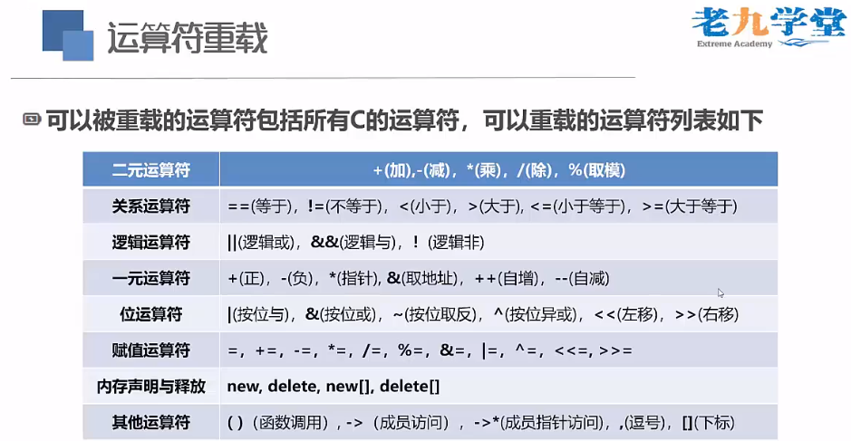

# C++ 程序的编译与执行过程

## 编译和执行过程
- 1、编译（预处理 -> 编译 -> 目标文件）；
  - 预处理：加载 "#include<头文件>" 形成 *.ii **预处理文件** ，执行命令为 "g++ -o test.ii -E test.cpp" ；
  - 编译：将 *.ii 文件编译成 *.s **汇编文件** ，执行命令为 "g++ -o test.s -S test.ii" ；
  - 形成目标代码/文件。目标代码是编译器的输出结果，是 *.o **二进制文件** ，常见扩展名为".o"或".obj"。执行命令为 "g++ -o test.o -c test.s"；

- 2、连接
  - 目标代码跟C++函数库相连接，并将源程序所用的库代码与目标代码合并。执行命令为 "g++ -o test.exe test.o"；
    - 静态连接文件：
    - 动态连接文件：
  - 形成最终可执行的二进制机器代码（可执行程序）；

- 3、执行
  - 在特定的机器环境下运行C++应用程序。
  

## 指针

&emsp;&emsp;指针是一个值为内存地址的变量（或数据对象）
### 指针变量
&emsp;&emsp;

### 指针和引用
&emsp;&emsp;指针和应用两者之间的关系：
> - 引用对指针进行了简单封装，底层仍然是指针；
> - 获取引用地址时，编译器会进行内部转换(类似给地址取了别名)。例如如下：

```C
int num = 100;
int& rel_num = num;    // 编译器在执行时，会将这一步在内部转换成： int* rel_num = &num;
rel_num = 110;         // 编译器在执行时，会将这一步在内部转换成： *rel_num = 110;
cout << &num << '\t' << &rel_num << endl;
```

### 堆内存，栈内存
&emsp;&emsp;栈区内存系统管理，读写速度快，只是发送指令？堆区内存程序员分配与释放管理？是执行指令具体步骤？例如：
```C
int num = 10;    // 栈区
// 而实际上在堆区需要执行以下两步操作：
int * p = new int;    // 堆区
*p = 90;        // 堆区
```

### 指针操作数组
&emsp;&emsp;

## 程序的内存分配
### 栈区（stack）
- 由编译器自动分配释放，一般存放函数的参数值、局部变量的值等；
- 操作方式类似数据结构中的栈-先进后出；

### 堆区（heap）
- 一般由程序员分配释放，若程序不释放，程序结束时间可能由操作系统回收；
- 注意：与数据结构中的堆是两回事，分配方式类似于链表；

### 全局区（静态区 static）
- 全局变量和静态变量是存储在一起的；
- 程序结束后由系统释放；

### 文字常量区
- 常量字符串就放在这里，程序结束后由系统释放。

### 程序代码区
- 存放函数体的二进制代码

```C
int num1 = 0;    // 全局初始化区
int * ptr1;    // 全局未初始化区
int main()
{
  
  int num2;    // 栈区
  char str[] = "yijiantao";    // 栈区
  char * ptr2;    // 栈区
  char * ptr3 = "yijiantao";    // "yijiantao"以及'\0'在常量区，ptr3在栈区

  static int num3 = 1024;    // 全局（静态）初始化区

  ptr1 = new int[10];    //分配内存在堆区
  ptr2 = new char[20];    //分配内存在堆区
  // 注意：ptr1和ptr2变量本身是在栈区中的，只不过把堆区中的地址赋值给了栈区中的变量

  return 0;
}
```


## 函数
### 函数指针
&emsp;&emsp;

### 内联(inline)函数
&emsp;&emsp;是C++为提高程序运行速度所做的一项**改进；** 与常规函数的区别在于编译器使用函数代码替换函数调用；

&emsp;&emsp;内联(inline)函数如果调用N次，则会复制N个副本；而普通函数调用N次，也只在堆区存在一次，多个函数调用（函数地址）而已。

&emsp;&emsp;适用场景：类的存储等；

&emsp;&emsp;内联(inline)函数定义（关键字：inline）与调用方式如下：
```C
inline void show()
{
  cout << "yijiantao";
}

int main()
{
  show();    // 内联函数show()在调用时，等效于直接将show()函数里所有的语句复制于此；
  ///在这里show()等效于将cout << "yijiantao";语句复制于此
  return 0;
}
```
&emsp;&emsp;使用建议：如果执行函数代码的时间比处理函数调用机制的时间长，则节省的时间将只占整个过程的很小一部分。通常内联函数的执行时间是要求要比普通函数执行速度快的，一般内联函数代码非常简单明了，不能含有递归调用等；**如果代码执行时间很短，内联调用就可以节省大部分时间。** 

### 参数的引用传递（重点）
#### 引用（reference）
- 为对象起了另外一个名字（引用即别名）；
```C
int int_value = 1024;

int& refValue = int_value;    // refValue指向int_value，是int_value的另一个名字

int& refValue2;    // 错误：引用必须被初始化

int& refValue3 = 1024;    // 错误：不可以直接引用常量(字面量)

const int& refValue4 = 1024;    // 正确，指向常量的引用 - 合法；因为常量的基本概念是

```

&emsp;&emsp;注意：
- 1、引用并非对象，只是为了一个已经存在的对象起的别名；
- 2、引用只能绑定在对象上，不能与字面值或某个表达式的计算结果绑定在一起；
  - 例如：int& refValue3 = 1024;    // 错误
- 3、引用必须初始化，所以使用引用之前不需要测试其有效性，**因此使用引用可能会比使用指针效率高。** 
- 4、引用更接近const指针，一旦与某个变量关联起来，就将一直效忠于它；
- 5、将引用变量用作参数时，函数将使用原始数据，而非副本；
- 6、当数据所占内存比较大时，建议使用引用参数；

#### 使用引用参数

- 详见../LeetCode Algorithms/test.cpp代码中Swap()和Show()函数示例；

#### 返回引用类型
&emsp;&emsp;函数返回引用类型
- 1、不要返回局部变量的引用；(因为局部变量有生命周期)。如下代码：
- 2、函数可以不返回值，默认返回传入的引用对象本身；
- 3、返回引用时，要求函数参数中包含被返回的引用对象。
```C
int& sum()    // 返回引用类型的函数
{
    int num = 10;

    // 注意：rNum是在sum()函数中定义的，所以叫局部变量
    // rNum的生存期只在sum()函数中;
    int& rNum = num;

    // 函数中的局部变量会被内存回收
    // 所谓的内存回收，并不是把内存保存的设置清零
    // 而是指内存中你的程序申请的这块内存已经不是这个变量了，会被覆盖的！
    return rNum; // 返回了一个局部的引用类型变量 （禁止！绝对不要返回局部变量的引用！）
}
void test()
{
  int x = "占内存变量1";
  int y = "占内存变量2";
  int z = "占内存变量3";
}
int main()
{
  // result在这里引用了一个局部变量
  int& result = sum();
  test();    // 调用其他函数，注意这里会分配内存，有可能会分配到将局部变量引用释放掉后的内存
  cout << "result = " << result << endl;
  return 0;
}
```

#### **函数返回引用类型建议：** 
- 1、将返回类型修改为const int&
    const int& sum(int& num){……}
- 2、const类型为不可修改的左值，sum(num) = 1024 将函数再赋值时将不合法，编译不通过；
- 3、省略const会使函数的含义更加模糊，建议避免在设计函数中存在模糊的情况，因为模糊会增加犯错误的机会，应尽量避免犯错。
    const int& sum(const int& num){……}


#### **使用引用参数的一些指导原则：** 
- 1、能够修改调用函数中的数据对象；
- 2、数据对象较大时传递引用可以提高程序运行效率；
    - 2.1 函数中不需要修改传递的参数：
      - 如果数据对象很小，建议按值传递；
      - 传递数组只能使用指针，并使用const关键字；
      - 较大的对象则使用const指针或引用，以提高程序的效率。
      
    - 2.2 函数中需要修改传递的参数时：
      - 数据对象是基本类型或结构时，可以使用指针或引用（基本类型建议使用指针）；
      - 数据对象是数组时只能使用指针；
      - 数据对象是类对象时，要求使用引用。

### 默认参数
&emsp;&emsp;在函数声明时默认赋初始值，如下：
#### **使用默认参数注意：** 
- 1、默认值可以在函数原型**或者** 定义中给出，**不能在这两个位置同时出现！** 
- 2、对于带参数列表的函数，必须**从右向左** 添加默认值。
    void test1(int a, int b = 5, int c = 10);    // 正确! test1(1); | test1(1, 2);
    void test2(int a, int b = 5, int c);        // 错误！ 默认参数后的参数int c也必须有默认值！
    void test3(int a = 1, int b = 5, int c = 10); // 正确！ test3(); | test3(1); | test3(1, 2);

```C
void sample(int = 100);
int main()
{
    sample();
    sample(123);
    return 0;
}

void sample(int num)
{
  cout << num << endl;
}
```

### 函数重载（重点）
&emsp;&emsp;函数重载（overloading）:1、指可以有多个同名的函数；2、函数名相同，参数列表不同（特征标不同）。
#### **函数重载注意：** 
- 1、从编译器的角度看，Swap(int)和Swap(int&)的特征标是相同的，调用时都可以写作：Swap(123)，为避免混乱，编译器把类型引用和类型本身视为同一个特征标。
- 2、调用匹配函数时，不区分const和非const变量。

其中：特征标，重载-编译器在编译时，根据参数列表对函数进行重命名，如下：
```C
void Swap(int a, int b);
根据特征标，编译器会重命名函数为：Swap_int_int

void Swap(float a, float b);
根据特征标，编译器会重命名函数为：Swap_float_float

有歧义时，编译器【重载决议】，来决定调用不同的函数：Swap_int_int
void Swap(int& a, int& b)
根据特征标，编译器会重命名函数为：Swap_int_int

```


### 函数模板（难点）
&emsp;&emsp;


## 类
### 类的声明
- 使用class / struct关键字声明类型；
    - class 类名{};
    - struct 类名{};
- 注意：
  - 1、class方式声明的类型与struct声明的类型仅仅是形式上不同；
  - 2、其唯一的区别在于使用class声明的类型默认成员是**私有的（private）**，而struct声明的类型默认成员是**公有的（public）。** 


#### 作用域解析运算符
::

返回类型 类名::函数名(){
    // 函数执行语句
}


#### 访问修饰符


#### 构造函数
1、定义：
- 以类名作为函数名
- 无返回值类型

2、作用：
- 初始化对象的数据成员
- 类对象被创建时，编译器为对象分配内存空间并自动调用构造函数以完成成员的初始化

3、构造函数的种类
- 无参构造（默认构造）
- 一般构造（重载构造）
- 拷贝构造

4、注意：
- 4.1 如果创建的类中未书写任何构造函数，系统会自动生成默认的无参构造函数（函数为空，什么都不做）
- 4.2 如果书写了构造函数，系统就不会再自动生成默认构造；如果希望有一个这样的无参构造函数，需要自己**显示**地书写出来


#### 带参构造
&emsp;&emsp;
pass


### 堆与栈内存详解
&emsp;&emsp;
栈内存（存放基本数据类型：整型、float、double型、字符型、对象句柄等）：栈里内存共享，容量小，不能将所有数据都放栈内存；（多个函数栈）


栈内存：类似于宜家展览区，根据物品取货码去仓库（堆内存）提货；
堆内存：类似于家具仓库；全局数据区；

### 使用类创建对象


### 泛型编程的本质：
&emsp;&emsp;屏蔽掉数据和操作数据的细节，让算法更为通用，让编程者更多地关注算法的结构，而不是在算法中处理不同的数据类型。
&emsp;&emsp;所以，不同的语言在设计上都会做相应的取舍，比如：C 语言偏向于让程序员可以控制更多的底层细节，而 Java 和 Python 则让程序员更多地关注业务功能的实现。而 C++ 则是两者都想要，导致语言在设计上非常复杂。


### this 关键字

#### this指针
- 每个成员函数（包括构造和析构）都有一个this指针；
- this指针指向调用对象，即可以通过this关键字访问当前对象的成员；
  - 访问成员变量：this->成员名;
  - 访问成员函数：this->函数名();

#### 注意：
- 1、this指针的类型为类类型 \*const(类名\*const),为右值；
- 2、this指针本身不占用大小，它并不是对象的一部分，因此不会影响sizeof的结果；
- 3、this的作用域在类成员函数的内部；
- 4、this指针是类成员函数的第一个默认隐含参数，编译器自动维护传递，类编写者不能显式传递；
- 5、只有在类的非静态成员函数中才可以使用this指针，其他任何函数都不可以！


## 运算符

### 运算符重载Operator Overloading（重点、难点）
&emsp;&emsp;运算符重载就是“想法转换”，它的目标是简化函数调用的方式；
- 1、把标准的函数使用方式，重新定义为自己认为的方式；
- 2、所谓重载，就是赋予新的含义；
- 3、运算符重载也是一个道理，同一个运算符可以有不同的功能；

&emsp;&emsp;实际上，我们已经在不知不觉中使用了运算符重载：
- +号可以对不同类型（int、float等）的数据进行加法操作；
- <<既是位移运算符，又可以配合cout向控制台输出数据；
- C++本身已经对这些运算符进行了重载；

- **运算符重载的语法格式：** 
    - 返回类型 operater被重载的运算符(参数列表)

- **编译器实际调用：** 
    - num3 = num1.operator+(num2);


（代码详见../cpp_test/Integer.cpp Integer.h main4Integer.cpp）

### 详解const
&emsp;&emsp;

（代码详见../cpp_test/ConstDemo.h main4ConstDemo.cpp）

### 友元函数

#### 什么时候用成员函数？什么时候用友元函数呢？
&emsp;&emsp;运算符声明成类成员还是声明独立友元函数建议准则：
- C++规定，赋值运算符=、数组下标运算符[]、函数调用运算符()、成员访问运算符->在重载时必须声明为类的**成员函数**；
- 流运算符<<、>>、类型转换运算符不能定义为类的成员函数，只能是**友元函数**；
- 一元运算符和复合赋值运算符重载时，一般声明类的**成员函数**；
- 二元运算符在运算符重载时，一般声明为**友元函数**；

#### 注意：
- 1. 对于很多运算符来说，可以选择使用成员函数或非成员函数来实现运算符重载，一般来说，非成员函数应该是友元函数，这样才能直接访问类的私有数据。
- 2. 在定义运算符时，必须选择其中的一种格式，而不能同时选择这两种格式，同时定义这两种格式将被视为二义性错误，导致编译错误。
- 3. 那么哪种声明格式最好呢？对于某些运算符来说，成员函数时唯一合法的解释。在其他情况下，这两种格式没有太大的区别。有时，根据类的设计，使用非成员函数版本可能更好（尤其是为类定义类型转换时）。

### 一元运算符重载
&emsp;&emsp;

### 重载<<运算符（重点）
&emsp;&emsp;不能重载的运算符有5个：
- .(点运算符)
- *(成员指针访问运算符)
- ::(域运算符)
- sizeof(长度运算符)
- ?:(三元运算符/条件运算符)

&emsp;&emsp;能重载的运算符如下图所示：
<p align="center"></p>

**注意：** 
- 重载不能修改运算变量个数。
  - 比如，关系运算是二元运算的，重载后也必须有两个变量参数运算。

- 重载不能修改运算符的优先级别。
  - 比如，"*"和"/"运算优先于"+"和"-"，重载后这个优先级不会被修改。

- 重载不修改运算顺序。
  - 比如，赋值运算是从右到左的，重载后不能改变。

### 类的自动转换和强制类型转换
&emsp;&emsp;类型转换函数：
- 类型转换函数的作用就是将当前类类型转换为其他类型
- 它只能以成员函数的形式出现，也就是只能出现在类中

```C
// 类型转换函数的语法格式
operator type(){
  return data;
}
```
&emsp;&emsp;类型转换函数的特点：
- 类型转换函数看起来没有返回值类型，其实是隐式地指明了返回值类型
- 类型转换函数也没有参数，因为要将当前类的对象转换为其他类型
  - 实际上编译器会把当前对象的地址赋值给this指针，这样在函数体内就可以操作当前对象了。
```C
operator float() const{
  return this->width;
}

operator Circle(){
  return Circle(width * 2);
}
```

&emsp;&emsp;注意：
- 1. type可以是内置类型，类类型以及由typedef定义的类型别名，任何作为函数返回类型的类型（void除外）都是被支持的（不允许转换为数组或函数类型，可以转换为指针或引用类型）;
- 2. 类型转换函数一般不会更改被转换的对象，所以通常被定义为const;
- 3. 类型转换函数可以被继承，可以是虚函数。

<p align="center"></p>

## 继承和派生
&emsp;&emsp;使用继承（Inheritance）
- 优点：
  - 基类定义公共内容，方便统一修改
    - 代码的可重用性：类库（不需要了解核心技术的细节）
  - 重定义基类的成员函数
  - 添加新类、新成员（职业）方便

- 注意：
  - 1. 派生类对象存储了基类的数据成员。即，派生类继承了基类的实现；
  - 2. 派生类对象可以使用基类的非私有函数。即，派生类继承了基类的接口；
  - 3. 派生类需要自己的构造函数；
  - 4. 派生类可以根据需要添加额外的数据成员和函数。

### 理解继承和派生（重点）（难点）

### 派生类声明方式

### 派生类的组成

### 派生类成员访问（重点）

### 派生类的构造函数和析构函数

### 公有继承、私有继承及受保护继承（难点）


## 多态
