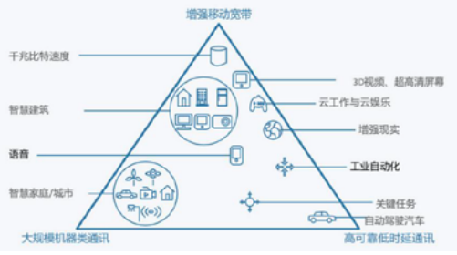
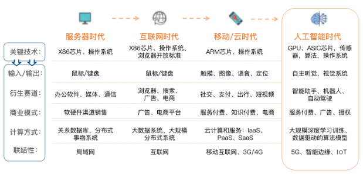
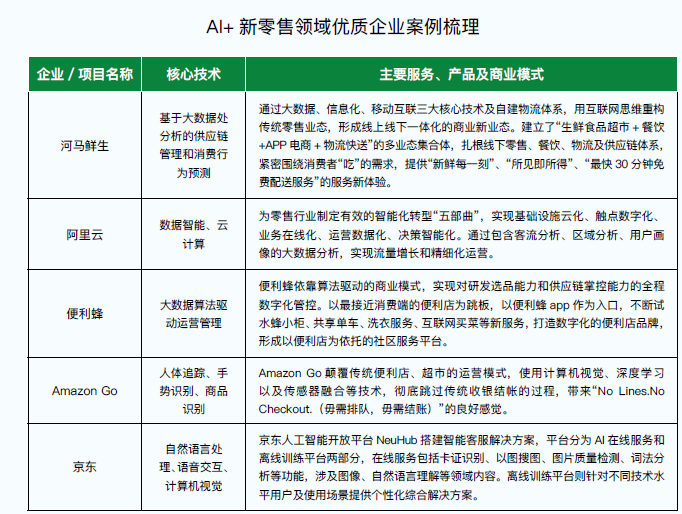
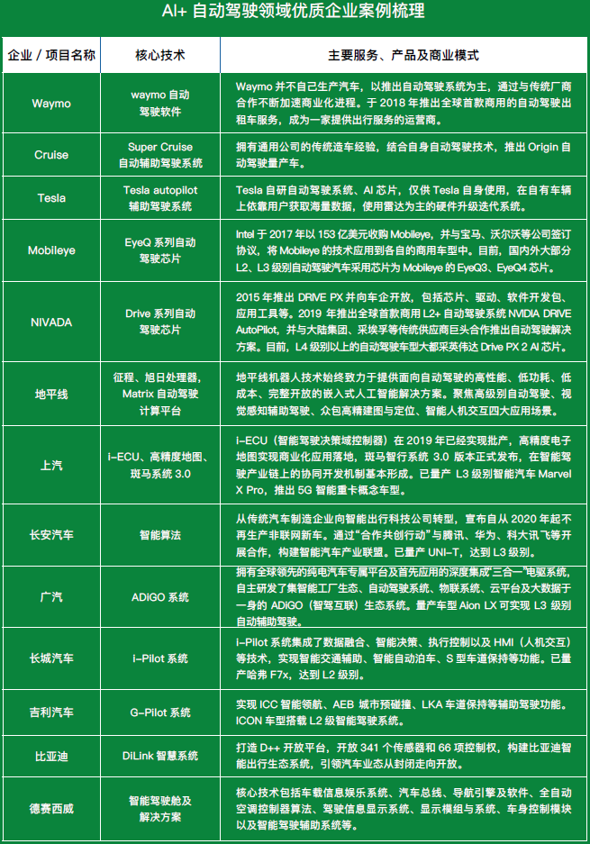

# CS前沿技术知识拾贝

## 
&emsp;&emsp;新科技助力消费行为由传统的“拥有 + 消耗”转变为“使用 + 体验”，物联网正塑生产要素和市场的关联方式;

&emsp;&emsp;从行业和技术领域来看，**生物医学、能源材料和计算机与通信** 这三大类的高科技公司是这个名单
上比例最高的公司（2017 年的名单中，这三大类上
榜公司占据了 80% 以上）。虽然具体的技术热潮
会有起伏，但是这三大方向始终领导着创新的潮流。

## 新兴技术的前景

- 5G新基建？带来的创新？
 5G 新型网络架构、先进编码、大规模天线等新技术纳入

ITU召开的ITU-RWP5D第22次会议上，第一次定义了未来5G应具有的三大类应用场景：`eMBB(增强移动宽带)`、
`mMTC(大规模机器通信)`、`URLLC(高可靠低时延通信)`，前者主要关注C端移动通信，有望率先实现应用，而后两者则更侧重于物料网等B端应用场景；

- 移动增强宽带(eMBB)应用场景是对4G路径的消费领域升级，如超高清视频、新一代社交网络，浸入式游戏等。

## 旧技术的创新点
- 人工智能：
&emsp;&emsp;相关技术开始逐步占据医疗、金融、保险、新闻等产业的核心地位，并且不断渗入人们的日常生活。

&emsp;&emsp;总体来说，当前我们仍处于“弱人工智能”阶段，即利用现有智能化技术，改善我们经济社会发展所需要的一些技术条件和应用功能。“强人工智能”阶段将接近于人的智能，这需要脑科学等一系列的突破，学界普遍认为在 2050 年前后将进入这一阶段。“超级人工智能”指脑科学和类脑智能成熟后，使人工智能成为一个超强的智能系统，从技术发展看，从脑科学突破角度发展人工智能，目前还存在相当局限性。

##### 跨媒体分析与推理技术
以往的媒体信息处理模型往往只针对某种单一形式的媒体数据进行推理分析，如图像、语音、文本识别等，而随着多媒体和网络技术的迅猛发展，海􁰁的图像、视频、文本等跨媒体数据快速增长，它们多源异构且相互关联，使得数据表征、信息检索、知识发现、语义推理面临跨媒体、跨数据源等挑战。

“跨媒体”即跨越视觉、听觉、语言等不同的感官信息认知外部世界，比单一的媒体对象及其特定的模态更加全面地反映特定的内容信息。当前，跨媒体智能的关键技术主要集中在智能信息检索、分析与推理、知识图谱构建、智能存储等方面，其应用趋势主要在于网络内容监管、舆情分析、信息检索、智慧医疗、自动驾驶、智能穿戴设备等场景。近年来，跨媒体分析推理技术在产业界和学术界也不断取得突破，IBM 智能问答系统、Google 利用搜索模式来预测流感的传播情况、百度知识图谱等都是较为成功的应用案例。

##### 类脑芯片
FPGA 即现场可编程门阵列，功耗低
ASIC：定制化的专用人工智能芯片，VPU 和TPU 都是基于ASIC 架构的设计。目前，在
图像和语音识别领域的ASIC 芯片应用较为成熟，
VPU 芯片专用于图像处理，FAGA 和TPU 芯片专用
于语音识别。

##### AI + 安防
##### AI + 金融
风控、信审；
通过大数据系统前置风控，

短期内，AI 技术对
金融业更多起到辅助作用，如更好进行身份识别提
升安全性，优化交易处理、合规审核等流程效率，
以及替代􁯿复性人工操作等。长期来看，AI 技术可
能产生颠覆性影响，从根本上改变我们借贷、储蓄、
支付、投资和保险方式；

##### AI + 医疗
医学图像分析技术
大数据信息管理：发展了AI 部署管理平台、AI 大数据挖掘科研平台以及AI 临床应用平台在内的医疗AI 全流程平台，打造出医疗质控、健康管理以及科研创新等医AI 产品。

##### AI+ 新零售
- 基于大数据处分析的供应链管理和消费行为预测、大数据算法驱
动运营管理

##### AI+ 自动驾驶

- 云计算
- 5G 车联网、物联网、远程控制、无人机、AR/VR、云游戏
- VR
- 大数据
- 区块链：
- 量子通信
- 无人驾驶
- 穿戴设备

