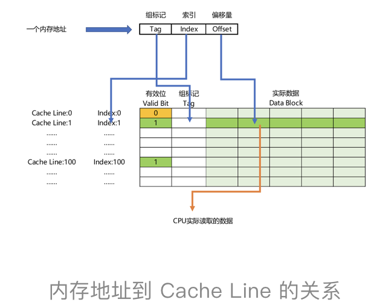

# 数字逻辑电路

## 半加器（一位二进制计算）

半加器 = 异或门(异或运算/半加运算) + 与门(进位信号)

<p align="center"></p>

讲与、或、非门的时候，我们很容易就能和程序里面的“AND（通常是 & 符号）”“ OR（通常是 | 符号）”和“ NOT（通常是 ! 符号）”对应起来。可能你没有想过，为什么我们会需要“异或（XOR）”，这样一个在逻辑运算里面没有出现的形式，作为一个基本电路。其实，异或门就是一个最简单的整数加法，所需要使用的基本门电路。

算完个位的输出还不算完，输入的两位都是 11 的时候，我们还需要向更左侧的一位进行进位。那这个就对应一个与门，也就是有且只有在加数和被加数都是 1 的时候，我们的进位才会是 1。

所以，通过一个异或门计算出个位，通过一个与门计算出是否进位，我们就通过电路算出了一个一位数的加法。于是，我们把两个门电路打包，给它取一个名字，就叫作半加器（Half Adder）。

## 全加器(二位二进制计算)

全加器 = 两个半加器 + 或门

<p align="center"></p>
这个 W 就是我们在二位上留下的结果。我们把两个半加器的进位输出，作为一个或门的输入连接起来，只要两次加法中任何一次需要进位，那么在二位上，我们就会向左侧的四位进一位。因为一共只有三个 bit 相加，即使 3 个 bit 都是 1，也最多会进一位。这样，通过两个半加器和一个或门，我们就得到了一个，能够接受进位信号、加数和被加数，这样三个数组成的加法。这就是我们需要的全加器。


唯一需要注意的是，对于这个全加器，在个位，我们只需要用一个半加器，或者让全加器的进位输入始终是 0。因为个位没有来自更右侧的进位。而最左侧的一位输出的进位信号，表示的并不是再进一位，而是表示我们的加法是否溢出了。这也是很有意思的一点。以前我自己在了解二进制加法的时候，一直有这么个疑问，既然 int 这样的 16 位的整数加法，结果也是 16 位数，那我们怎么知道加法最终是否溢出了呢？因为结果也只存得下加法结果的 16 位数。我们并没有留下一个第 17 位，来记录这个加法的结果是否溢出。

# CPU
&emsp;&emsp;指令流水，现代CPU ARM架构14级指令流水，过高的指令流水会带来功耗和冒险(结构冒险、数据冒险)的问题，冒险问题有可能导致退化成单指令的周期的CPU；

- 指令周期
- 时钟周期
- 机器周期

## 冒险
- **结构冒险**：哈佛结构与冯诺依曼结构的结合，哈佛结构主张内存架构分为（指令内存和数据内存）；如果内存地址空间对应一个地址译码器的话会有寻址冲突；而现在计算机在冯诺依曼结构的基础上，在CPU与内存之间多加了一层：指令缓存和数据缓存，两个地址译码器；

- **数据冒险**：
1、数据依赖：先写后读  [objdump -d 输出汇编代码看看]
```C
int a = 1;
int b = 2;
a = a + 2;
b = a + 3;
```

2、反依赖：先读后写
```C
int a = 1;
int b = 2;
a = b + a;
b = a + b;
```

3、输出依赖：写后再写
```C
int a = 1;
a = 2;
```

# 编译

# 链接
&emsp;&emsp;为什么Linux编译好的程序没法直接拿到Windows下来执行，Linux链接ELF和Windows链接PE过程不一样；


# CPU - 高速缓存

一个内存的访问地址，最终包括高位代表的**组标记**、低位代表的**索引**，以及在对应的Data Block中定位对应字的**位置偏移量**。


<p align="center"></p>

如上图所示，内存地址到Cache Line的对应关系

而内存地址对应到Cache里的数据结构，则多了一个有效位和对应的数据，由 **索引+有效位+组标记+数据** 组成。


Nginx 源码

Unix网络编程学习
