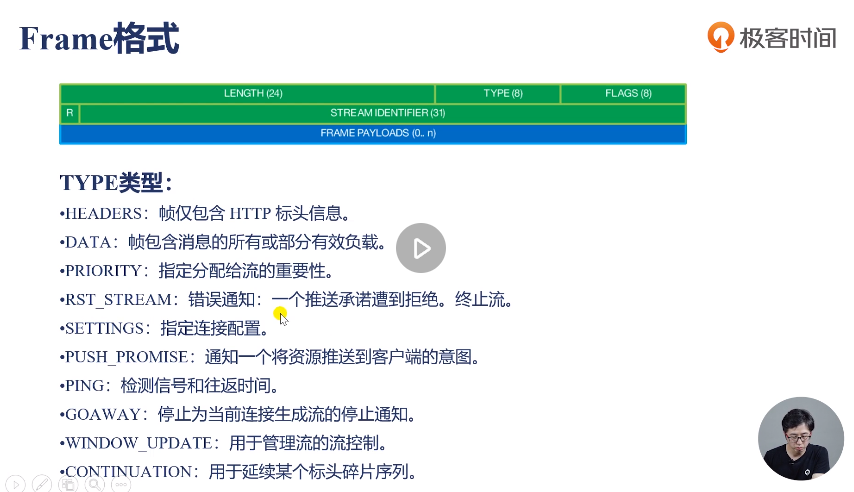

# HTTP 笔记

## HTTP2主要特性
- **传输数据量的大幅减少** 
    - 以二进制方式传输
    - 标头压缩

- **多路复用及相关功能** 
    - 消息优先级

- **服务器消息推送** 
    - 并行推送

## HTTP2.0核心概念

- **连接Connection：** 1个TCP连接，包含一个或者多个Stream(多路复用：多个Stream，多个Message)
- **数据流Stream：** 一个双向通讯数据流，包含多条Message
- **消息Message：** 对应HTTP1中的请求或响应，包含一条或者多条Frame
- **数据帧Frame：** 最小单位，以二进制压缩格式存放HTTP1中的内容

传输中无序，先缓存，接收时拼装；
