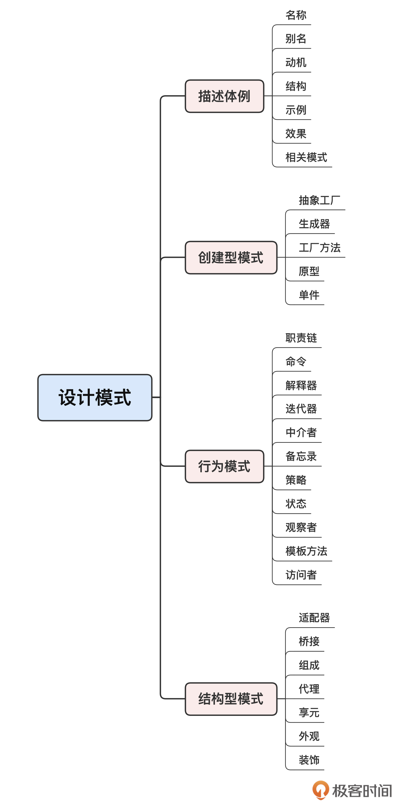
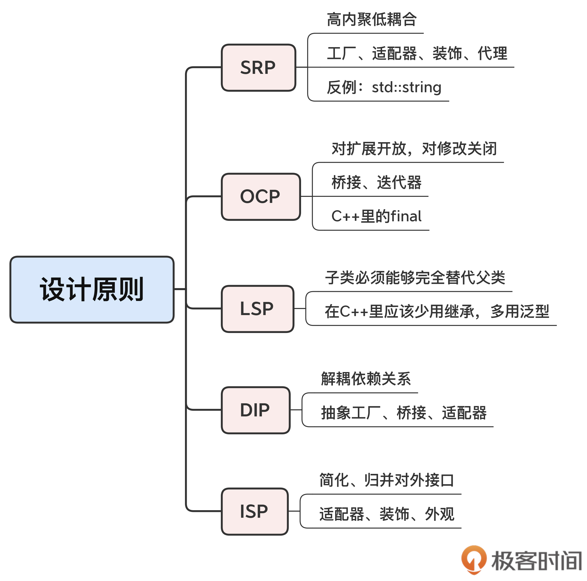

# cpp设计模式

## 学好设计模式的方法
&emsp;&emsp;学习、理解设计模式，才能用好面向对象的C++.

&emsp;&emsp;经典的《设计模式》一书里面介绍了 23 个模式，并依据设计目的把它们分成了三大类：**创建型模式、结构型模式和行为模式。** 这三类模式分别对应了开发面向对象系统的三个关键问题：
- 如何创建对象;
- 如何组合对象;
- 以及如何处理对象之间的动态通信和职责分配。

&emsp;&emsp;解决了这三大问题，软件系统的“架子”也就基本上搭出来了。

### 有没有“设计‘设计模式’的模式”呢？

嗯，这个真的有。其实，这些更高层次的指导思想你可能也听说过，它们被通称为“设计原则”。

最常用有 5 个原则，也就是常说的“SOLID”。
- 1、SRP，单一职责（Single ResponsibilityPrinciple）；
- 2、OCP，开闭（Open Closed Principle）；
- 3、LSP，里氏替换（Liskov Substitution Principle）；
- 4、ISP，接口隔离（Interface-Segregation Principle）；
- 5、DIP，依赖反转，有的时候也叫依赖倒置（Dependency Inversion Principle）。

“Solid”:

"dry":(Don't Repeate Yourself)

"kiss":(Keep It Simple Stupid)

&emsp;&emsp;学习、理解设计模式，才能用好多范式的C++.

## cpp中运用哪些设计模式
[待续]
...

### 结构型模式

接下来说说结构型模式，它关注的是对象的静态联系，以灵活、可拆卸、可装配的方式组合出新的对象。
这里你要注意结构型模式的重要特点：虽然它会有多个参与者，但最后必定得到且使用的是“一个”对象，而不是“多个”对象。结构型模式一共有 7 个，其中，我觉得在 **C++ 里比较有用、常用的是适配器、外观和代理。** 

&emsp;&emsp;代理模式在 C++ 里的一个典型应用就是智能指针（第 8 讲），它接管了原始指针，限制了某些危险操作，并且添加了自动生命周期管理，虽然少了些自由，但获得了更多的安全。

但除了这些经典的设计模式，还有很多其他的设计模式，比如**对象池、空对象、反应器、前摄器、包装外观，等等。** 

